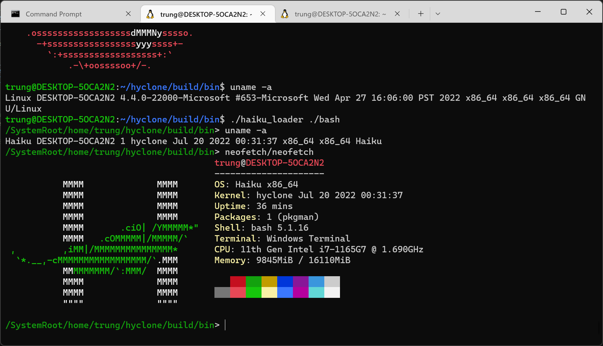
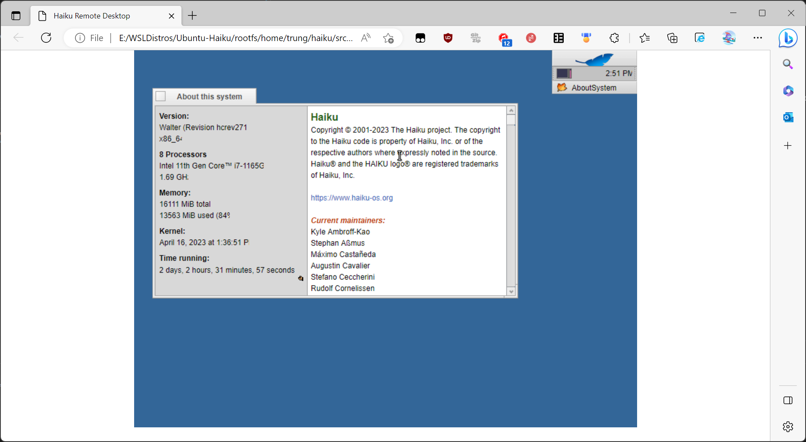

# HyClone

[](https://github.com/trungnt2910/hyclone/actions/workflows/build.yml)

HyClone is a runtime environment for [Haiku](https://github.com/haiku/haiku) applications.

HyClone currently targets and supports Linux, but should be, with some modifications, portable to any ELF-based SysV OSes (including Haiku itself).

Currently, HyClone only supports x86_64.

## Build instructions

### Building Haiku objects

HyClone uses precompiled objects from a Haiku build. Therefore, the first step is to fetch a copy of Haiku sources and build it.

On an Ubuntu machine:

```
sudo apt install -y git nasm bc autoconf automake texinfo flex bison gawk build-essential unzip wget zip less zlib1g-dev libzstd-dev xorriso libtool python3

cd hyclone
./copy_objects.sh
```

`copy_objects.sh` fetches a copy of the Haiku official source code, builds the neccessary targets, and copies the required precompiled object files to the HyClone source tree.

By default, `copy_objects.sh` stores the cloned source code (`haiku` for the OS, `buildtools` for the Haiku cross-compilers) at HyClone's parent directory, for example:
```
CodingProjects
|
|--- hyclone
    |
    |--- copy_objects.sh
|--- haiku
|--- buildtools
```

If you want to change the Haiku source and Build tools source locations, or if you are a Haiku developer wishing to use your existing Haiku work environment, you can set these
environment variables to change where `copy_objects.sh` looks for objects:

- `HAIKU_ARCH`: The Haiku build architecture. Only the default value, `x86_64` is currently supported.
- `HAIKU_BUILD_ENVIRONMENT_ROOT`: The root folder of the Haiku build environment. By default, it is the parent directory of the HyClone source.
- `HAIKU_BUILD_SOURCE_DIRECTORY`: The folder where Haiku's source code should be stored. Defaults to `$HAIKU_BUILD_ENVIRONMENT_ROOT/haiku`.
- `HAIKU_BUILD_TOOLS_DIRECTORY`: The folder where the source code for Haiku's build tools should be stored. Defaults to `$HAIKU_BUILD_ENVIRONMENT_ROOT/buildtools`.
- `HAIKU_BUILD_OUTPUT_ROOT`: The folder where Haiku's build output should be stored. Defaults to `$HAIKU_BUILD_SOURCE_DIRECTORY/generated.$HAIKU_ARCH`.

### Building HyClone

```
cd hyclone
sudo apt install -y cmake libgmp-dev libmpfr-dev zlib1g-dev libzstd-dev
mkdir build; cd build
cmake ..
# For test builds, do this to install everything to the build directory:
# cmake .. -DCMAKE_INSTALL_PREFIX=.
sudo make install
cd ..
```

The HyClone source directory must be placed in the same directory as Haiku, so that it could detect and copy the required object files.

### Running HyClone

In order to get Haiku apps running (`bash`, `gcc`,...), we need a Haiku installation with basic system directories, libraries, and configuration files.

To build this environment, HyClone comes with a `build_hprefix.sh` script.
The script assumes that a copy of Haiku source code is available at `$HAIKU_BUILD_SOURCE_DIRECTORY`

```
# Set this to the path where you want to store your Haiku root.
export HPREFIX=~/.hprefix
# Assuming you're at the root of the HyClone source tree
./build_hprefix.sh
```

`build_hprefix.sh` installs just enough packages to start a `bash` shell. To install other packages, use the `-A` option, or the `-S` option if
the packages belong to the system repository.

```
# Strings are comma-separated.
./build_hprefix.sh \
    -A="gcc,binutils,gmp,mpc,mpfr,zlib" \
    -S="haiku_devel"
```

Now, assuming that you're at `$CMAKE_INSTALL_PREFIX`, run:

```
cd bin

# This will be appended to $PATH by haiku_loader
export HPATH=/boot/system/bin:/boot/system/non-packaged/bin
./haiku_loader bash --login
```

### Installing applications

HyClone supports Haiku's default package manager, `pkgman`. To install additional packages to a HyClone prefix, simply do what you would do on Haiku:

```
pkgman install -y <package name>
```

You can also update your HyClone environment using `pkgman`:

```
pkgman full-sync
```

### Running GUI apps

HyClone can run Haiku's `app_server`. Due to various HyClone missing components, it is currently not launched automatically by `launch_daemon`. To run `app_server`, from a HyClone shell, type:

```
/boot/system/servers/app_server &
```

Then, you can open a remote desktop session by following this [guide](https://discuss.haiku-os.org/t/instruction-of-using-haiku-remote-desktop/9442) as if you were working on a real Haiku machine.

### Demo

A screenshot of HyClone on WSL1:



HyClone remote desktop:



### Notes

- Many apps might not work on HyClone as this project is still in its early stages. You might run into errors or missing syscalls ("stubs"). If you encounter any of these, please let me know by opening an issue.
- The host's root is mounted on HyClone as `/SystemRoot`. When translating calls from Haiku to the host system, HyClone maps the Haiku root to `$HPREFIX`, and when translating the results, HyClone appends `/SystemRoot` to the host's root.